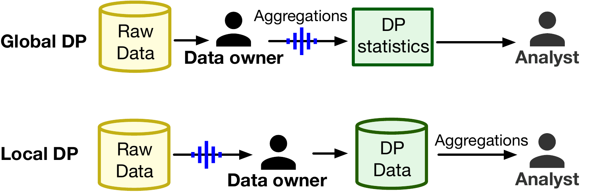
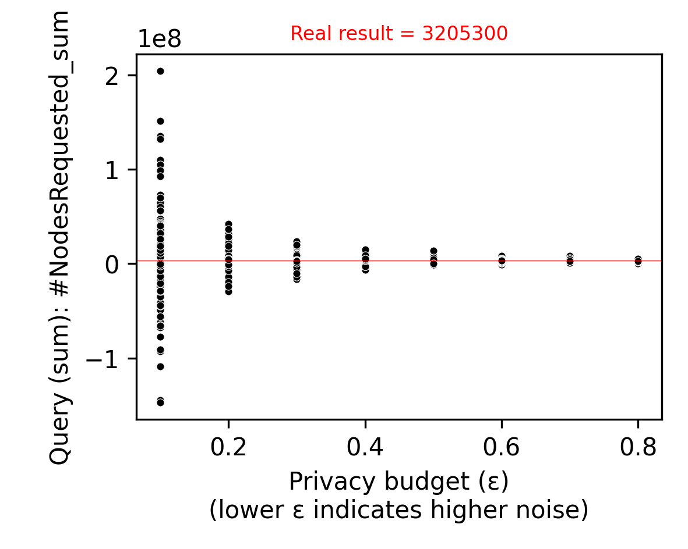
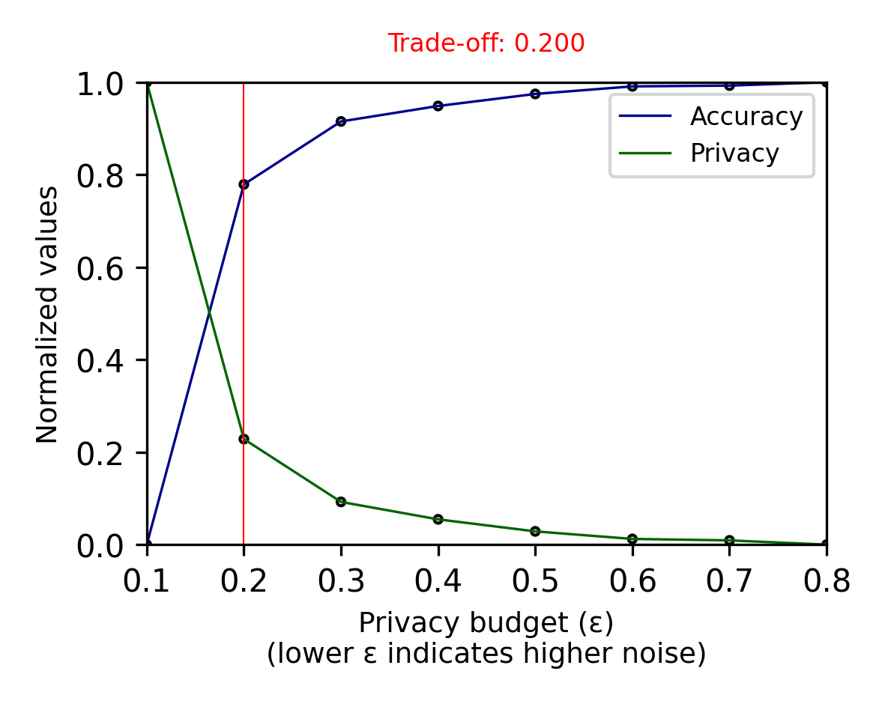

#  Privacy-Preserving Transformations of HPC Traces using Differential Privacy

Differential privacy (DP) provides mathematical guarantees that data can remain private even after transformations to hide Personal Identifiable Information (PII). Our toolset aims to facilitate using DP to protect sensitive data in HPC system logs for Global DP and local. In Global DP the data owner knows the queries the analyst will perform over in advance. The data owner will then release the DP query results with a privacy budget guarantee. In Local DP, noise is added to each individual data point before the dataset values are aggregated, the data owner usually prioritizes higher privacy protection by adding more noise since any process applied to the data is unpredictable.



## Configuring environment

We used Python version 3.8.10 and R version 4.2.3, run the following commands to install the required libraries:

```
conda create -n myenv python=3.8.10
conda activate myenv
pip install -r requirements.txt
```

```
install.packages(c("tidyverse", "data.table", "ggforce", "arrow", "hms", "scales", "patchwork", "Hmisc"))
``` 

Installation of ggpatern and tidyverse migh be needed for R packages:
```sh
sudo apt install libgdal-dev
sudo apt-get install libharfbuzz-dev
```

## Open HPC traces: 

- OLCF: https://doi.ccs.ornl.gov/ui/doi/334 
- ALCF - all DIM_JOB_COMPOSITE files: https://reports.alcf.anl.gov/data 

We recommend downloading the data and putting them in the following directories, although our toolset allow you to define all paths via command line:
```sh
mkdir -p data/ALCF
mkdir -p data/OLCF
```

## Data processing

### Parsing 

Parse data to get the most relevant columns:

```sh
Rscript preprocess_data/parse_ALCF.R
Rscript preprocess_data/parse_OLCF.R
```

Example:
```
UserID,ProjectID,QueueName,#NodesRequested,#CoresRequested,WallTimeRequested,QueuedTimestamp,StartTimestamp,EndTimestamp,EligibleQueueTime,Runtime,#NodeSecondsUsed,#CoreSecondsUsed
67550677511631,40773989651712,backfill,1024,16384,1500,2014-12-31 09:22:28.000000,2014-12-31 23:58:30.000000,2015-01-01 00:19:27.000000,52563,1257,1287168,20594688
61648062878124,59933165581865,prod-short,4096,65536,21600,2014-12-18 17:39:38.000000,2014-12-31 18:19:20.000000,2015-01-01 00:19:57.000000,112830,21637,88625152,1418002432
13158054236861,59813733799296,prod-short,512,8192,7200,2014-12-30 16:03:16.000000,2014-12-31 23:26:28.000000,2015-01-01 00:27:14.000000,112992,3646,1866752,29868032 
```

### Pre-processing

Create neighbors and aggregate data by the column of interest (job id, user, etc) to apply transformations:

```sh 

python preprocessing/main.py -indir data/ALCF/Cooley/ -outdir data/globaldp/Cooley/ -sysname Cooley -col UserID
python preprocessing/main.py -indir data/ALCF/Theta/ -outdir data/globaldp/Theta/ -sysname Theta -col UserID
python preprocessing/main.py -indir data/ALCF/Mira/ -outdir data/globaldp/Mira/ -sysname Mira -col UserID
python preprocessing/main.py -indir data/OLCF/ -outdir data/globaldp/Titan/ -sysname Titan -col user_id

# Optional, also aggregate by multiple columns
python preprocessing/main.py -indir data/ALCF/Cooley/ -outdir data/CooleyMultiple/ -cols "UserID" -cols "WeekDay"
```

## Execution

Toolset parameters:

- (-m) Methods: (1) global DP, (2) local DP
- (-epsilon) One or more values for epsilon
- (-acc) Desired accuracy from 0-1 for the query of interest 
- (-data) Dataset in CSV format
- (-neighbors) Neighbor databases folder
- (-i) Iterations for the same epsilon
- (-q) Query: mean, sum, std, var, max, min, count, median
- (-lib) Library to calculate DP results: PyDP or diffpriv
- (-c) Sensitive column(s) to apply the query. More than one column can be used, but should be defined individually. Exp: -c sum_jobs -c mean_runtime
- (-a) Name of the aggregation column for datasets grouped by one column. Exp: Month, System, StartHour
- (-out) Output file name - to be stored in the CSV file format

As now, one or multiple values of epsilon for global dp and a single value of epsilon for local dp.

### Example - Global

```
python code/main.py -data data/globaldp/Cooley/all.csv -m 1 -out output/globaldp/cooley_nodes_sum_complete.csv -neighbors data/globaldp/Cooley/neighbors/ -i 150 -c "#NodesRequested_sum" -q sum -epsilon 0.1 0.2 0.3 0.4 0.5 0.6 0.7 0.8
```

Expected output:

```
ORIGINAL DATASET --------------------------------------------------------

           UserID   Jobs  ProjectID_sum  ...  Runtime_mean  #NodeSecondsUsed_mean  #CoreSecondsUsed_mean
0    2.410598e+10  44691   2.185953e+18  ...   3431.428726               7.007943              84.095321
1    2.363218e+11    277   2.725221e+16  ...  16351.953069               1.000000              12.000000
2    3.771237e+11      6   1.651157e+13  ...   1849.666667               1.000000              12.000000
3    4.394847e+11    591   2.178505e+16  ...  11198.868849              15.807107             189.685279
4    5.010821e+11      2   5.399050e+13  ...     48.000000               1.000000              12.000000
..            ...    ...            ...  ...           ...                    ...                    ...
932  9.922269e+13      1   5.708754e+13  ...     40.000000               1.000000              12.000000
933  9.926200e+13      1   7.439498e+11  ...   3623.000000               1.000000              12.000000
934  9.959741e+13     10   6.317098e+14  ...   4657.200000               1.200000              14.400000
935  9.974155e+13      1   6.825925e+13  ...     45.000000              10.000000             120.000000
936  9.988435e+13    258   3.377231e+15  ...   3853.054264               7.635659              91.627907

[937 rows x 18 columns]

- Columns selected: ['#NodesRequested_sum']
- Query: SUM
- Batch size: 118
- Aggregation column:  
- Column to query: #NodesRequested_sum
- Original query result: 3205300
- Sensitivity:313296

Epsilon: 0.1
DP result: 4799449.75
Epsilon: 0.2
DP result: 4346742.62
Epsilon: 0.3
DP result: 4125779.55
Epsilon: 0.4
DP result: 3948184.7
Epsilon: 0.5
DP result: 3808944.21
Epsilon: 0.6
DP result: 3731112.68
Epsilon: 0.7
DP result: 3668901.26
Epsilon: 0.8
DP result: 3618504.05
Saved figure to output/globaldp/cooley_nodes_sum_complete.png
Saved figure to output/globaldp/cooley_nodes_sum_complete_privacy_acc.png

SYS USAGE:
main: Memory consumed: 187,801,600
Execution time: 577.8008480072021 sec
```

Expected output file [cooley_nodes_sum_complete.csv](./output/globaldp/cooley_nodes_sum_complete.csv):

```
aux,DB,DP_DB,DP_DA,Rep,DA,Epsilon,Col,Error,EuD,Query
1,3201879.188900747,3594306.7674826845,-1682053.532623291,0,3205300,0.1,#NodesRequested_sum,4887353.532623291,190861065.49384302,sum
1,3201879.188900747,3713706.380737097,7841123.6095581055,1,3205300,0.1,#NodesRequested_sum,-4635823.6095581055,190075398.37776676,sum
1,3201879.188900747,3272339.2436136594,-9709455.287963867,2,3205300,0.1,#NodesRequested_sum,12914755.287963867,426707121.38715774,sum
1,3201879.188900747,3294569.295877988,470839.0961303711,3,3205300,0.1,#NodesRequested_sum,2734460.903869629,180018624.18836242,sum

```

Expected output figure:

